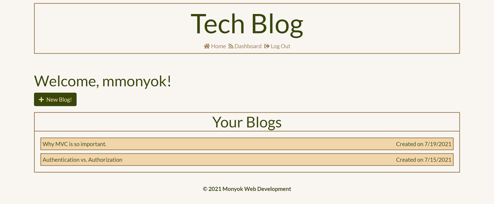
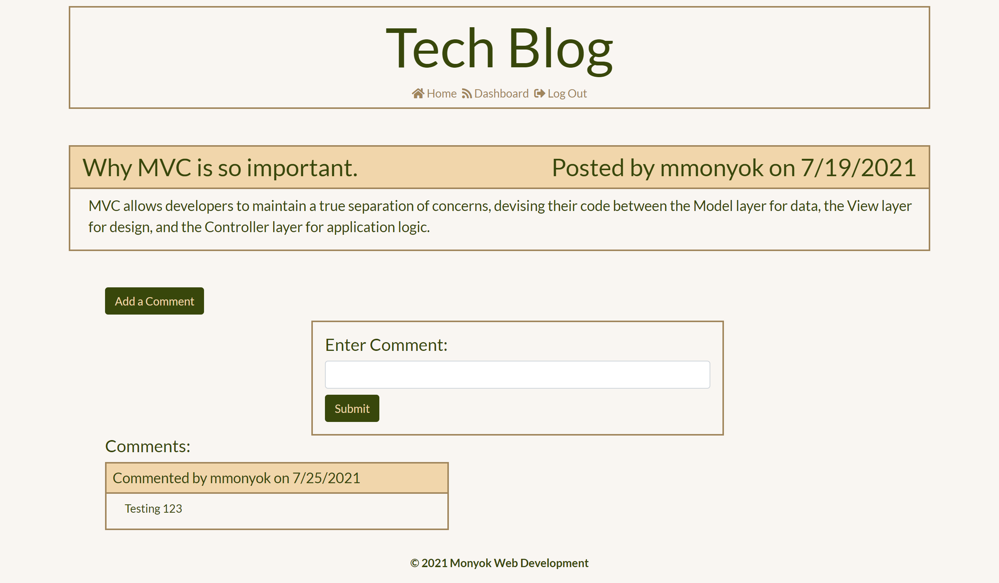

# TechBlog
A place to parrot your tech thoughts.

[Live site!](https://tech-blog-mmonyok.herokuapp.com/)

## Description
- Sometimes you have too many thoughts to keep them all inside; you need to share them with the world!
- Oh no. There are too many sites to choose from.
- Don't get lost in all the hub-bub. Use this Tech Blog site to share your darkest and brightest thoughts on the tech world.
- While building this application, I learned a lot about handlebars, routes, writing code for posting, putting, and deleting in front end js.

## Table of Contents
- [TechBlog](#techblog)
  - [Description](#description)
  - [Table of Contents](#table-of-contents)
  - [Installation](#installation)
  - [Usage](#usage)
  - [Credits](#credits)
  - [License](#license)
  - [Contributing](#contributing)
  - [Tests](#tests)
  - [Contact](#contact)

## Installation
1. Provided that you have a code editor of your choosing installed on your system, such as VS Code (https://code.visualstudio.com/),

2. Provided that you have a Terminal installed for Windows (https://www.microsoft.com/en-us/p/windows-terminal/9n0dx20hk701?rtc=1&activetab=pivot:overviewtab) or are using a Mac with Terminal installed with the OS,

3. Provided that you have npm and Node.js installed for windows (https://www.npmjs.com/get-npm),

4. Provided you have Git and Github Desktop installed (https://git-scm.com/downloads, https://desktop.github.com/) and have registered for an account,

5. Provided you have MySQL and MySQL workbench installed (https://www.mysql.com/downloads/),

6. Either Clone or Fork this repository: (https://github.com/mmonyok/TechBlog.git),

7. After cloning the repository to your local computer, initialize npm, as well as install dotenv, express, express-handlebars, express-session, mysql2, sequelize, connect-session-sequelize, and bcrypt node modules. 

## Usage
- On the homepage, you can view all written blogs, and any comments on them. 
- If you wish to comment on a blog or create a new blog, then you must sign up/log into the sight.
- Once logged in, you can view your dashboard, where it lists all blogs that you've written. When you click on one of those blogs you can edit the blog or delete it. You will also see any comments made on it.

## Credits
- Technologies Used:
  - [HTML](https://www.w3schools.com/html/)
  - [CSS](https://www.w3schools.com/css/)
  - [JavaScript](https://www.w3schools.com/js/)
  - [Bootstrap](https://getbootstrap.com/)
  - [FontAwesome](https://fontawesome.com/)
  - [ScreenToGIF](https://www.screentogif.com/)
  - [Node.js](https://www.npmjs.com/get-npm)
  - [NPM](https://www.npmjs.com/get-npm)
  - [Express.js](https://expressjs.com/)
  - [express-handlebars Node Module](https://www.npmjs.com/package/express-handlebars)
  - [express-session](https://www.npmjs.com/package/express-session)
  - [mysql2 Node Module](https://www.npmjs.com/package/mysql2)
  - [sequelize Node Module](https://www.npmjs.com/package/sequelize)
  - [connect-session-sequelize Node Module](https://www.npmjs.com/package/connect-session-sequelize)
  - [dotenv Node Module](https://www.npmjs.com/package/dotenv)
  - [bcrypt Node Module](https://www.npmjs.com/package/bcrypt)

- Additional Assets:
[Color palette taken from colorhunt.co.](https://colorhunt.co/palette/f9f6f2f1d6aba0855b38470b)

[Favicon downloaded from fontawesome. No changes were made.](https://fontawesome.com/license)

## License
MIT License

Copyright (c) [2021] [Melody Monyok]

Permission is hereby granted, free of charge, to any person obtaining a copy
of this software and associated documentation files (the "Software"), to deal
in the Software without restriction, including without limitation the rights
to use, copy, modify, merge, publish, distribute, sublicense, and/or sell
copies of the Software, and to permit persons to whom the Software is
furnished to do so, subject to the following conditions:

The above copyright notice and this permission notice shall be included in all
copies or substantial portions of the Software.

THE SOFTWARE IS PROVIDED "AS IS", WITHOUT WARRANTY OF ANY KIND, EXPRESS OR
IMPLIED, INCLUDING BUT NOT LIMITED TO THE WARRANTIES OF MERCHANTABILITY,
FITNESS FOR A PARTICULAR PURPOSE AND NONINFRINGEMENT. IN NO EVENT SHALL THE
AUTHORS OR COPYRIGHT HOLDERS BE LIABLE FOR ANY CLAIM, DAMAGES OR OTHER
LIABILITY, WHETHER IN AN ACTION OF CONTRACT, TORT OR OTHERWISE, ARISING FROM,
OUT OF OR IN CONNECTION WITH THE SOFTWARE OR THE USE OR OTHER DEALINGS IN THE
SOFTWARE.

## Contributing
- Please submit any contributions you think will improve this project.

## Tests
- No further testing is needed, unless any new contributions are made; the owner of this project will locally test any contribution submissions prior to approval.

## Contact
- Melody Monyok
  - <monyokwebdev@gmail.com>
  - (612) 492-1528
